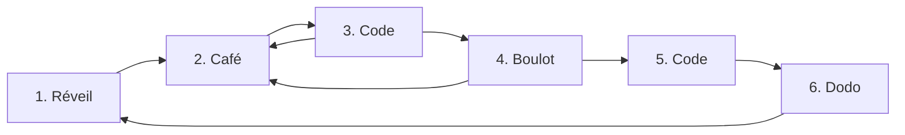

  

```mermaid
graph LR
     A[1. Réveil] --> B[2. Café]
     B --> C[3. Code]
     C --> B
     C --> D[4. Boulot]
     D --> B
     D --> E[5. Code]
     E --> F[6. Dodo]
     F --> A
```

---------

-----------

----------

