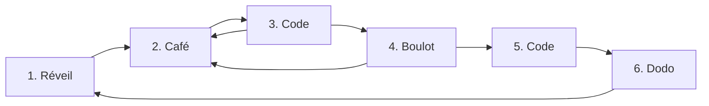
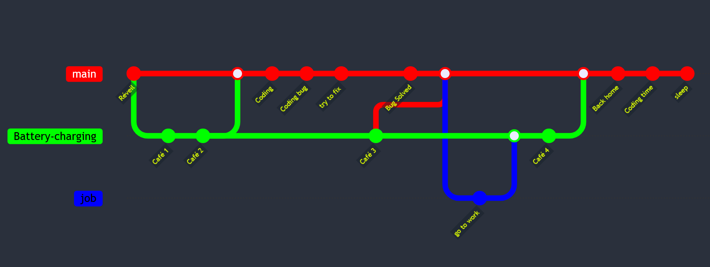

-----------

  

 Mermaid Style

 Gitgraph style

  

<a href="https://mermaid.js.org/syntax/gitgraph.html"/ > *code available in code-mermaid-git-graph.txt or in mermaid doc"</a>

---------

----------

<h2 align=center> Pythonist !</h2>

  
  
  
  <a href="https://www.selenium.dev/">
        
  </a>
  
  </a>
  

----------

<h2 align=center> A bit of Front </h2>

  
  
   
  

----------

<h2 align=center> One to Many DB  </h2>

  

  
  
  

----------

<h2 align=center> Linux First but Open-minded ...</h2>

  

  
  
   
       
          
          

----------

<h2 align=center> Dev-Tools ...</h2>
  

  
   
  
  
   
      

----------

