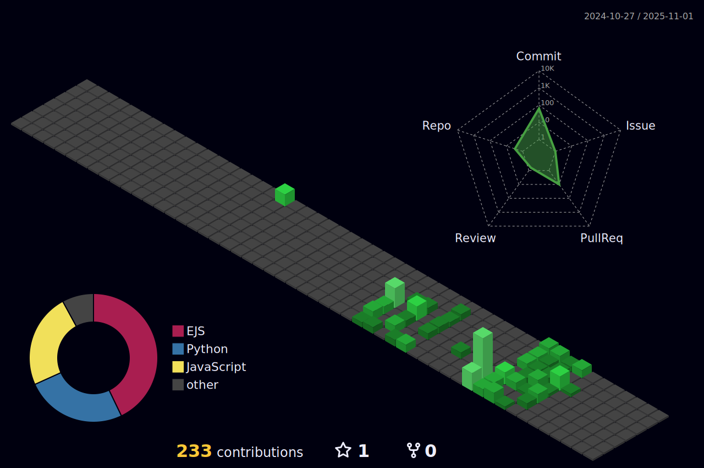

  

---------

-----------

----------

<h2 align=center> Pythonist !</h2>

  
  
  
      

----------

<h2 align=center> A bit of Front </h2>

  
  
  
  

----------

<h2 align=center> One to Many DB  </h2>

  
  
  

----------

<h2 align=center> Linux First but Openmind ...</h2>

  
  
    

----------

<h2 align=center> Dev-Tools ...</h2>
  

  
  
  

----------

